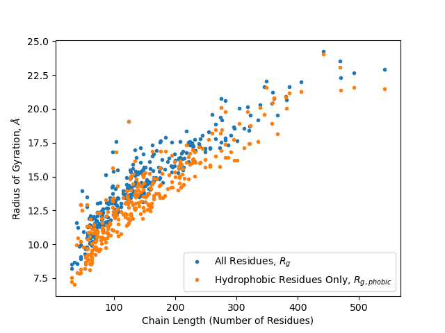
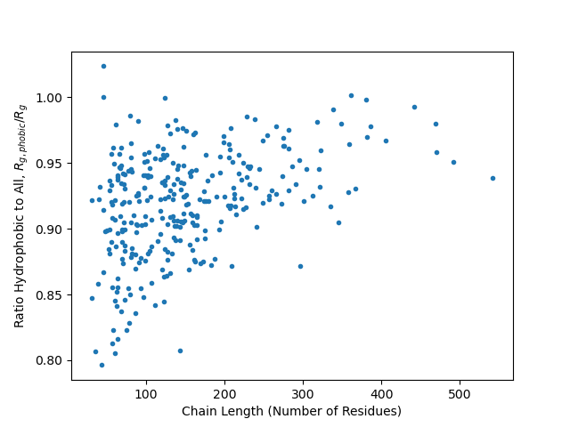

# pdb_analysis

Jackson Sheppard\
CH E 210D, Exercise 1\
10/05/22

Here we present an analysis of 309 protein sequences, computing structural
quantities such as the radius of gyration and statistical interaction
potentials. The input sequences are stored in
[The Protein Data Bank](https://www.rcsb.org/) `*.pdb` format and reside in the
`proteins/` directory at the root of this repository. Each file consists of
a protein X-ray crystal structure and thus includes atomic `X`, `Y`, `Z`
coordinates of each amino acid (residue) comprising the protein structure. In
this analysis, we read the sequences of our 309 proteins and compute the
radius of gyration considering all residues along with that for hydrophobic
residues only. We then plot both of these quantities along with their ratio
against the total number of residues in the structure. Finally, we compute and
visualize the "statistical" interation potential for the 20 amino acid types
by considering amino acid contacts present in this data set.

## Installation and Usage
Clone [this repository](https://github.com/jsheppard95/pdb_analysis) and
navigate to its root. Install dependencies from the `enironment.yml` file
using `conda`:

```
conda env create --name envname --file=environment.yml
```

If instead files are downloaded individually, ensure the `*.pdb` files are in
the relative path of working directory and that necessary dependencies are
installed.

Run the code to generate results as follows:

```
$ python exercise1.py
```

This yields both plots of the radius of gyration and statistical interaction
potentials computed from sequences in this data set. It also gives
console output in the following format:

```
filename sequence_length Rg_phobic Rg_all Rg_phobic/Rg_all
...Repeats for all *.pdb...

Lowest Interaction Energies:
RES-RES : Energy (kcal/mol)
---------------------------
...5 Lowest Interactions and Corresponding Energies...

Highest Interaction Energies:
RES-RES : Energy (kcal/mol)
---------------------------
...5 Highest Interactions and Corresponding Energies...
```

## Results
### Radius of Gyration
We coarse grain each protein structure in the data set by filtering to include
only alpha-carbon residues, those fixed to the backbone chain of the protein.
We the compute the radius of gyration for the coarse-grained sequence by first
summing over all residues and then over hydrophobic residues only. We then
create a scatter plot of each protein radius of gyration (for both all
residues and hydrophobic residues only) versus the protein chain chain length
(total number of alpha-carbon amino acids). We then compute and plot the ratio
of these radii, `Rg_phobic/Rg_all` and again plot the result against protein
chain length. The results are shown below.





We thus see the radius of gyration for hydrophobic residues only is in general
roughly 85%-95% of that for all residues. This could be due to the fact that
hydrophobic residues are more likely to be closer to the protein backbone as
opposed to its aqueous environment. However, as the chain length increases,
both radii increase and this hydrophobic property has a less significant
effect.

### Statistical Interaction Potential
